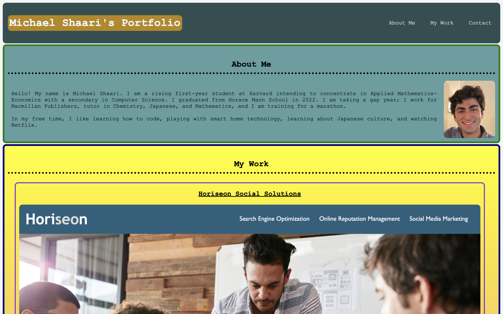

# Michael Shaari's Professional Portfolio

## Description

This project serves as a professional portfolio for Michael Shaari. Its purpose is to allow future employers and other individuals to see all of Michael's relevant professional work as a digital portfolio. It involves both HTML and CSS to function properly.

## Screenshot

Below is a series of screenshots to preview Michael Shaari's Professional Portfolio.

## Link to Michael Shaari's Professional Portfolio

Michael's portolio can be accessed by clicking [here](https://mshaari.github.io/module-2-challenge/).